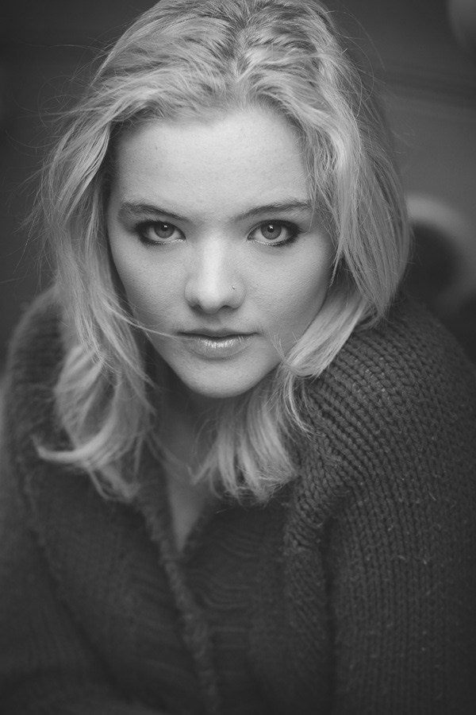
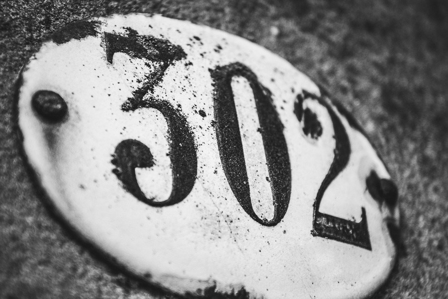
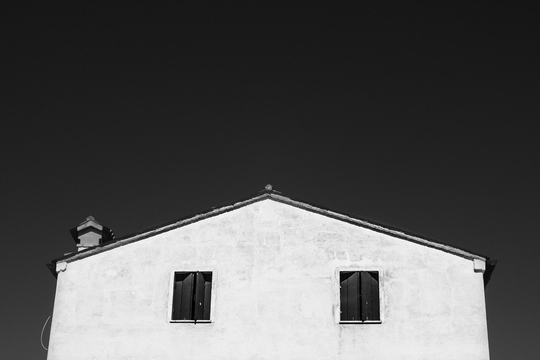
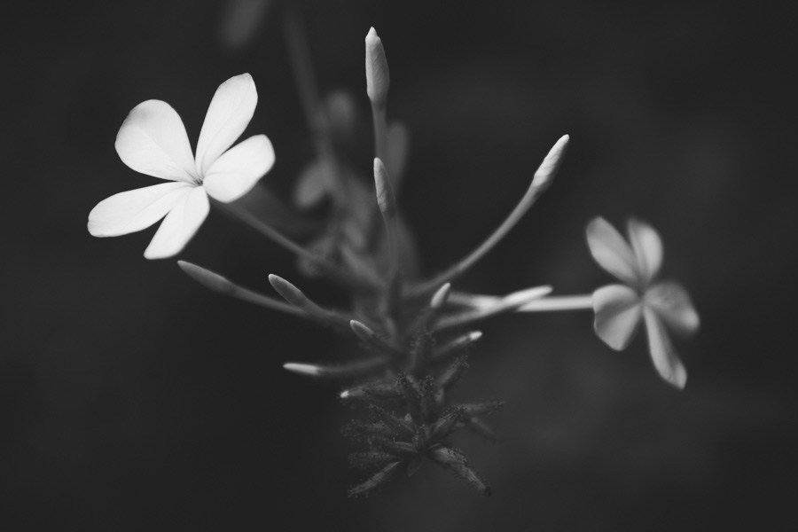
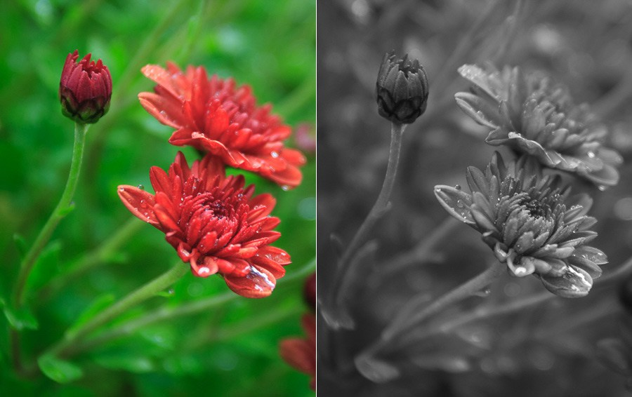
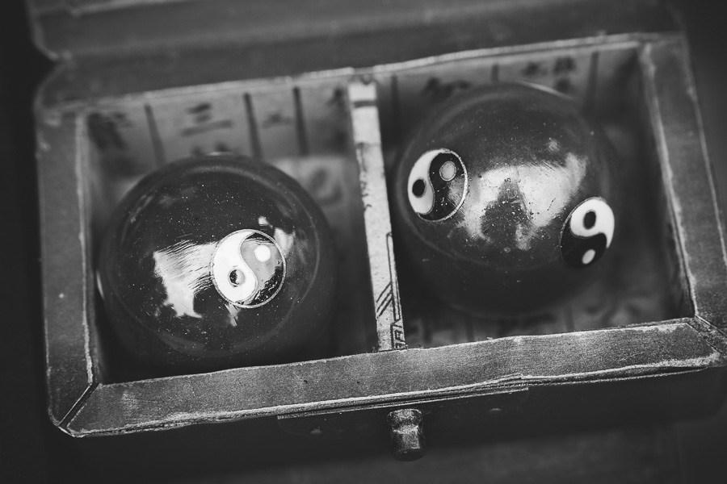
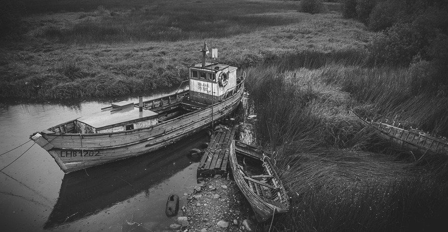

:toc: left
:toclevels: 3
:toc-title: EOS B&W Training

= EOS Black & White Training

== Thought Process - ESP!
* Evaluate
* Setup
* Produce

Picture the image in your mind, get it right in the camera first!

== Settings
Can set picture style to monochrome in camera. That can be customised.

* Sharpness
* contrast + 
(like printing on different grades of paper)
* filter effect (red, yellow, etc - same as adding filters to the lens)
* toning effect (colour tones, changing whole picture colour from grey to another hue)

=== Contrast

* Portraits = standard or less contrast
* landscapes = standard or more contrast

=== Filters
* Portraits = green filter, brings out skin/lips against the face
* Landscapes = red/orange better, brings out detail in sky & foliage

=== Toning
* sepia
* blue
* purple
* green

== Images
Without colour we are relying on __framing__, _lighting_ and _tones_ to make a good image. +
Have to remember that what we see, the reds & green that contrast agaisnt each other beautifully in colour may well come out in the same shade of grey in monochrome. +

=== Basics
Still have to get the basics right:

* exposure +
right for the key part of the image
* lighting +
Needs to be correct for the effect you're trying to produce. If it's very flat, it may not show the detail you need. Direction is obviously important.

* Not all images will work in B&W; you need to have a good contrast in a scene. +
* framing has to be simpler, as it is more difficult to cope with lots of details in B&W when viewing
* shapes more important!

=== The Photographic Eleemnts
(same for colour)

* line
* shape
* texture
* form

These are the building blocks of an image. +
*Line* & *shape* will work in any sort of ligting, *texture* & *form* need contrast and possibly side lighting to show up.

==== Line
Lines are compelling as  our eyes follow them, so we can use them to lead the viewer's eyes throught the picture or make the image look more dramatic.
Pointing the camera up produces converging lines

==== Shape
The physical outline of the subject; can be a silhouette. Even if it's not a sihouette, we need to think how the shape will stand out from the background. +
This will be using

* lighting - backlighting
* depth of field
* contrast - think how the colours will convert to greys

==== Texture
How the surface looks. For texture to show up, the lighting has to be right and ideally from the side and quite strong. +
In black & white , images entirely out of texture will work whereas they wouldn't have worked in colour because the colours weren't interesting.

==== Form
Related to texture, but is the whole subject rather then just the surface +
Form is what makes a subject look three dimensional +
Like texture it needs good lighting; in dull flat weather, it's often the lack of form that makes our images fail.

==== Tonal Range
The amount of tones that can be seen in an image. We have already mentioned that one of the ways this was controlled was by using different developing and printing papers. +
Tonal range is very important; if the image is lacking good tonal range it will either be very flat fo have very high contrast and look harsh. +

==== How to See Tonal Range
Look at the lighting; a lower contrast picture will probably mean more tones and detail but may be fairly undramtic. The opposite is also true. +
It may require spot metering or AE lock to capture the correct exposure for the mid-tone.

==== Lighting & Direction of Light
* front lighting needs a strong subject
* side lighting is good for shadows and so makes it more dramatic
* backlighting for silhouettes, if that's not what you want, you'll struggle to expose the shadows and highlights correctly.
* dull lighting will not produce dramatic images but good for detail & portraits.

==== The Human Element
Reportage still uses black and white images as people can be together with unsuitable/conflicting coloured surroundings. It sometimes also sanitises and improves the scene.

=== Summary
* Black and white images are different; so look for different components then for colour images
* Work with the lighting and look for & pick subjects that work with it.
* Practise picking one of; shape, line, texture, form, movement and hoot just that as practise.

= Creative Photographer Black & White tips

Working in black and white extends the hours in which you work 
productively. The golden hour is your prime time for creating landscape 
photos. But, depending on subject, you can also work during the day in 
harsher light or on cloudy days. But you may not work in color because 
the quality of the light isn’t good enough.

Seeing in black and white is about learning to see the shapes, patterns 
and textures that occur in the natural world and arrange the composition
 to suit them.

== Portraits

Photos of people often work well in black and white. Color tends to pull attention away from the model’s eyes and expression, which are the most important and revealing part of the portrait.

If you want a shortcut to taking dramatic black and white portraits, 
you can’t go too wrong with a simple prime lens (either a short 
telephoto or a normal focal length) and setting a wide aperture (f2.8 or
 wider) to blur the background.

Then it’s just a matter of finding a decent setting and a soft, 
flattering light. Then you are free to concentrate on communicating with
 your model and creating http://www.creative-photographer.com/natural-light-portraits/[beautiful portraits]. +

== Details
Go somewhere interesting like a market where there are lots of things
 to take photos of. Get in close and concentrate on details. You’ll get 
the best results with a normal or short telephoto lens (shorter focal 
lengths require you to get closer to the subject which may be awkward in
 a busy public place). Photos of details work best when you concentrate 
on shapes and texture.

I made this photo in a historic home. The textures of the metal 
utensils and the stone wall they are hanging against are beautiful.

=== Architectural Details
Similar to the previous, except that you are concentrating on 
architectural details like doorways, street numbers and so on. This is a
 great subject if you live somewhere with lots of old buildings as they 
tend to be made of beautiful textured, weathered materials that look 
beautiful in black and white.

I took this photo in a small town called Chascomus in Argentina. The 
street numbers in the old part of town were inscribed on these wonderful
 ornate plaques.

 

=== Buildings on sunny days

The light in the middle of the day is probably too hard to work well 
in color, but it can work very well in black and white. The idea is to 
look at the building you are photographing in terms of shape, form 
(shape in three dimensions) and texture. The blue sky becomes a dramatic
 gray backdrop that you can make darker with a polarizing filter or in 
Lightroom.

=== Landscapes

The landscape is a potentially tricky subject because you are so 
reliant on weather and light as well as your own photographic skills. 
But if you know some good locations for landscape photography it is 
worth spending some time shooting in black and white to see if it makes a
 difference to your approach.

Anything with texture tends to look good in black and white, so 
landscapes that include a lot of it tend to be promising subjects.

Long exposure photography, which is where you use neutral density 
filters to extend the shutter speed to two minutes or longer, is a 
relatively new genre of landscape photography that works well in black 
and white.

I used a shutter speed of 200 seconds to create this landscape photo.

image::images/how-see-black-white-9.jpg[]

== What to look for

We’ve already touched on this with the earlier portrait examples, but
 there are three things to be aware of when you are shooting in black 
and white that will help you compose better monochrome photos.

They are not the only http://www.creative-photographer.com/black-white-landscape-photos/[elements of composition] that make an interesting photo, but they are certainly enough to get you started.

=== Tonal contrast

Tonal contrast is the difference between the lightest and darkest 
areas of the subject. In black and white there is only one thing that 
determines how the subject looks in monochrome, and that is how much 
light it reflects. The more light a surface reflects, the brighter shade
 of gray it will be. The less light it reflects, the darker. The 
extremes at both ends of the grayscale spectrum are black and white.

Let’s take a simple example of a white flower against a dark 
background. The difference in brightness between the flower’s petals 
(white) and the dark background makes this an effective black and white 
composition.

However, if you photographed a red flower against a green background, 
there would be nearly no tonal contrast as both red and green reflect 
the same amount of light. There is plenty of color contrast, but no 
tonal contrast.

Tonal contrast is the basis of black and white photography.

=== Shape

You become good at composition when you learn to see the subject in 
abstract terms. Part of this process is learning to recognize shapes. In
 general, there are two types. The first are geometric shapes, such as 
circles, rectangles and squares. Many man-made objects break down into 
these shapes.

I photographed these massage balls in a market in Shanghai, China. 
The photo is comprised of two strong shapes – circles (the shape of the 
massage balls) and squares (the shape of the compartments in the box). 
The box itself also makes a rectangle.

The other is irregular shapes. A person silhouetted against the sun 
creates an irregular but easily recognized shape. Irregular, 
recognizable shapes can be very evocative.

=== Texture

Black and white is excellent for emphasizing texture. Without color 
we become a lot more aware of the textures of the surfaces included in 
the photo.

Some surfaces have lots of texture, like the rocks in the earlier 
portraits. Others have very little texture, like polished metal. If you 
can find some way of contrasting highly textured surfaces with smooth 
ones in your photo then you could have the basis of a very effective 
black and white image.

The texture of the grass and the wooden boats in this landscape are an important part of the photo.

== Conclusion

Hopefully this advice helps you with the process of learning to see 
in black and white. Even if you have no intention of doing much work in 
monochrome (which would be a shame, as it’s such an expressive medium) 
the skills learnt will help you compose stronger images in color too.

= AP
== The best subjects
Any subject that doesn’t rely on colour for its appeal will work in black & white. Landscapes work well because by stripping away colour you get back to the bare bones of the scene – the textures and shapes, the play of light and shadow. Portraits also tend to be more powerful in mono because there’s no colour to distract. The same applies to architecture, details and patterns, still-life, nude studies and flower portraits.  

== Make the best of bad weather

How many times have you gone out with a camera, intent on shooting some great images, only to return home empty handed because the weather turned foul? Well, if you think black & white that will no longer be a problem because ‘bad’ weather is perfectly suited to it. Dull, grey days produce great conditions for mono as the light’s soft and moody. Even rain needn’t stop play if you carry a brolly to keep your camera dry.  

== Filters
In the good old days of film, coloured filters (red, orange, yellow, green and blue) were used on the camera lens to control contrast and tonality when shooting black & white. These days, you can mimic the effects using filter presets in black & white conversion software such as Silver Efex Pro.

What do they do? Well, the basic rule is that the filter lightens its own colour and darkens its complementary colour, so a red filter will cause reds to come out as a lighter grey tone and blues and greens to come out much darker. Orange does a similar job to red but isn’t as extreme while yellow is more subtle still. A green filter lightens greens and blues but darkens reds and oranges, while a blue filter does the opposite to red – it lightens blues and darkens reds significantly.

It’s worth experimenting with these filter effects, especially if an image doesn’t look great when you first convert it to black & white. Red is good for boosting contrast and adding drama to the sky while green works well on landscapes. The benefit of adding the effect digitally is that if you don’t like it, you can cancel it and try another one.

== Reality doesn't matter so much
One of the great things about black & white is that by removing the colour from an image you’re also removing reality, which then gives you much more artistic and creative freedom. It doesn’t matter if the final image bears no resemblance to the original scene – so if you want to go dark and moody, or light and airy, do it!  
