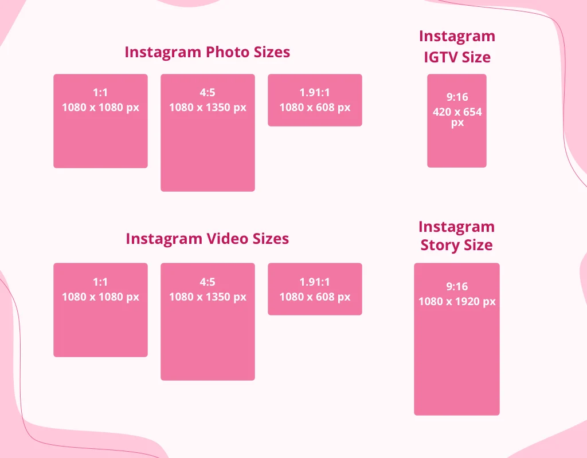

:toc: left
:toclevels: 3
:toc-title: Contents

= Instagram
:Author: Ian Cummings
:Email:
:Date: March 2022
:Revision: V0.1

== Picture sizes

At a standard width of 1080 pixels, Instagram keeps your photo its original size, as long as its height is between 566 and 1350 pixels. If your photo is less than 320 pixels wide, it’ll be stretched. If it’s more than 1080 pixels wide, it’ll be shrunk down. For those posts that are not square, as long as the dimensions of the pic remain as recommended, your image will look like it’s supposed to

|===
| Square || 1080 x 1080
| Landscape |1.91:1 | 1080w x 608h
| Portrait | 4:5 | 1080w x (566-) 1350h
| Story | 9:16 | 1080 x 1920
| Profile picture || 360 x 360
| IGTV Cover Photo | 1:1.55 | 420 x 654
| | |
| Video | |600 x 600
| Video portrait |4:5 |600 x 750
| Video landscape | 1.91:1 |600 x 315
| Video carousel | |600 x 600
|===