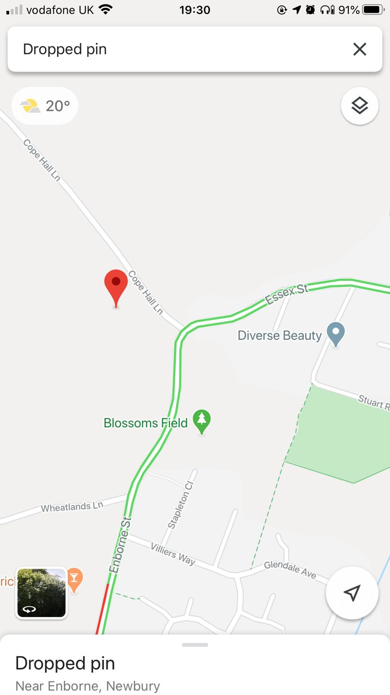
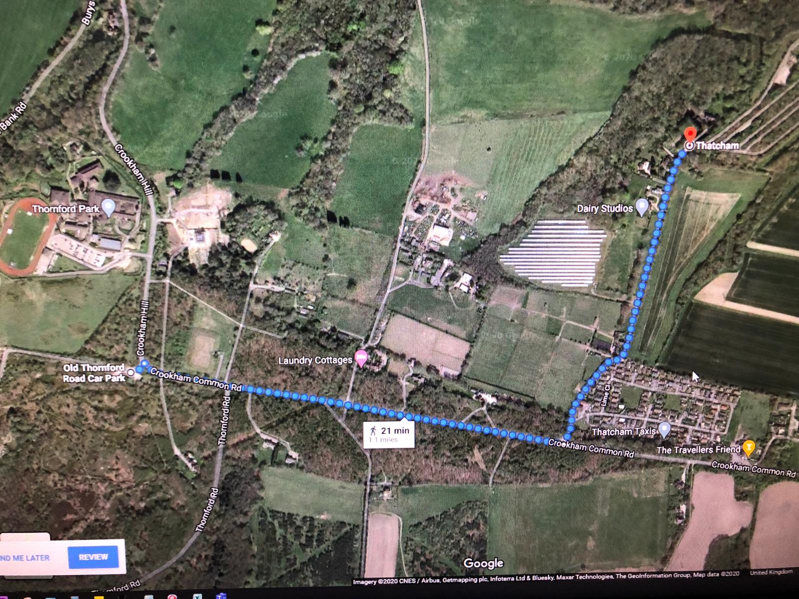

:toc: left
:toclevels: 3
:toc-title: Contents

= Photography locations
Ian Cummings <ian.cummings@bigfoot>
V0.1, May-2017
:Author: Ian Cummings
:Email: 
:Date: May 2017
:Revision: V0.1

== Locations
*  Afon Hepste Four Waterfalls walk
* Whiteford Lighthouse (Swansea; drive)

=== Sunflowers (September)
https://w3w.co/cages.paint.stable

=== Poppies
inkpen road

== Abandoned Engineering
Leaving Old Thornford Rd. car park (top of Crookham Hill) about 5.30.  Head along Crookham Rd (through woods) to the Park Home site then North past the location of WW2 prisoner of war camp to the mystery USAAF site- prob just over a mile. No sunset shots just some abandoned engineering - which is on Private property!

https://w3w.co/flagpole.wiggly.lifetimes

