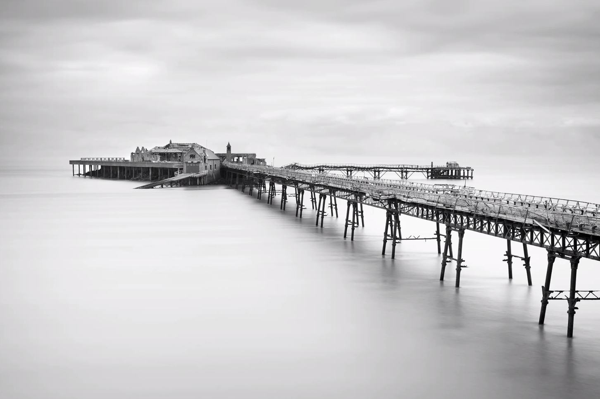
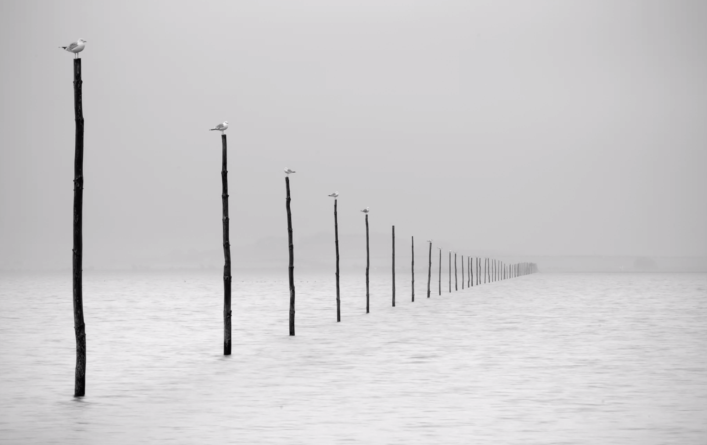

:toc: left
:toclevels: 3
:toc-title: Contents

= Mono (Black & White)
:Author: Ian Cummings
:Email:
:Date: July 2023
:Revision: V0.1

== Colin Jarvis
He is mainly monochrome, long exposure, land/seascape images

=== Settings
* 10 or 6 stop filter
** 6 stop filter -> 3 seconds?
* sometimes combined with 0.6 (2 stops) hard grad filter to bring out sky details.
* full frame 17-40mm canon L lens
* somewhere between 30s to 2mins exposure
* F13 - ish
* Often uses Photoshop to remove horizons, etc
* most of his pictures require getting you & your tripod in the water!
* Basically, high tide, long exposure, wellies, tripod protectors.
* for infra-red, use f5.6 and underexpose (2-3 stops) as otherwise you'll get hotspots

=== Places
* Marine Lake, Weston-Super-mare
* St. Annes
* Swanage
* Burnbeck Pier, Bristol Channel
* Llandudlo
* Cleveden Pier
* Lindisfarne, Holy Island

=== Images
image::../images/mono-moods/clipboard02.png[]
image::../images/mono-moods/clipboard06.png[]
image::../images/mono-moods/clipboard07.png[]
image::../images/mono-moods/clipboard08.png[]
image::../images/mono-moods/clipboard10.png[]

