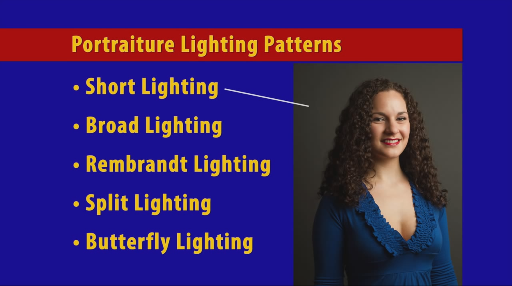
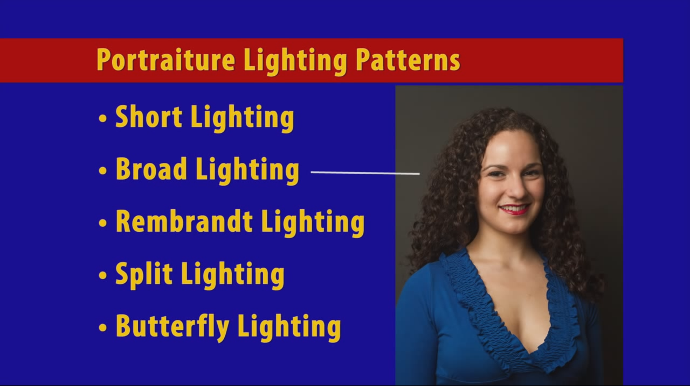
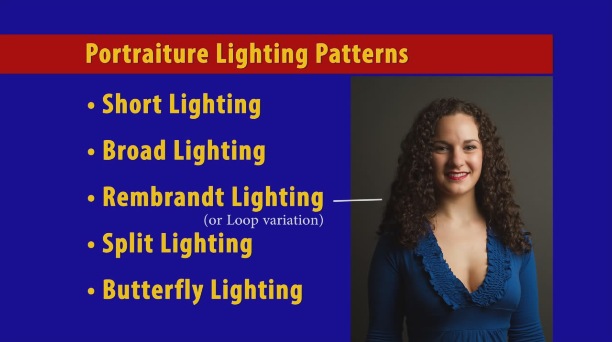
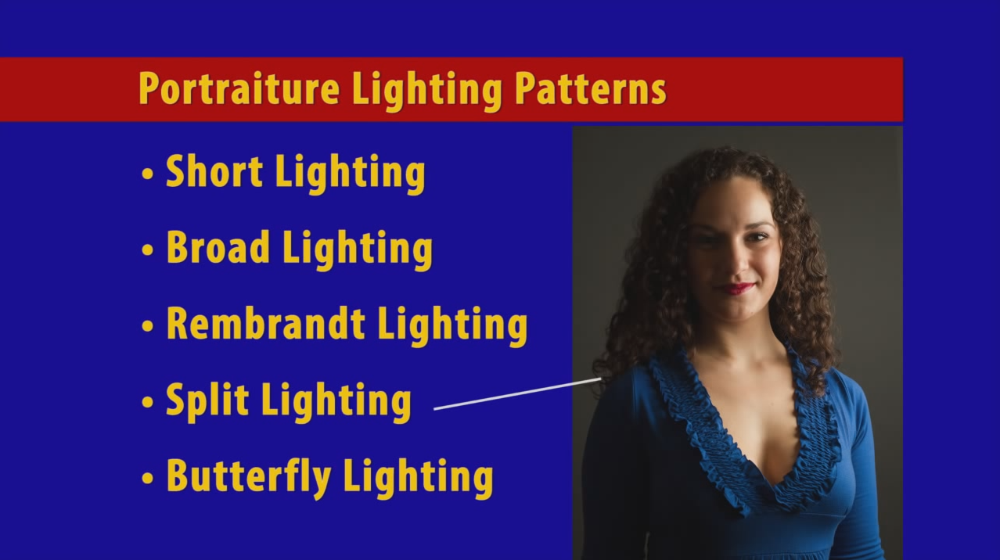
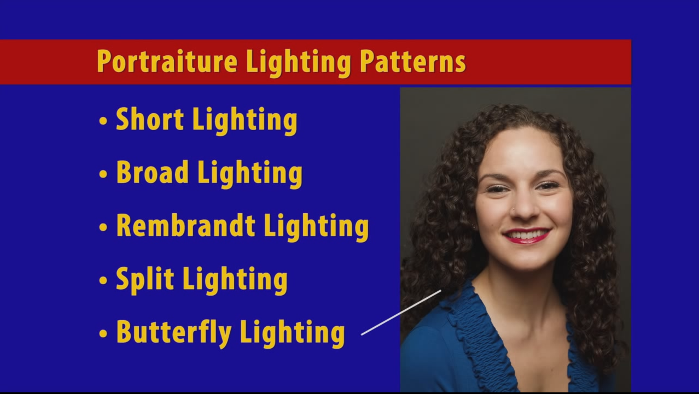

:toc: left
:toclevels: 3
:toc-title: Contents
// :imagesdir: ../images

= Five Basic Portraiture Lighting Patterns
Ian Cummings 
V0.1, May 2017: A work in progress

== Short lighting
Good for most subjects, classic & flattering. Narrows the face.

== Broad lighting
Make a narrow face fuller

== Rembrandt lighting
Classic, serious & dramatic, triangle of light under eye. If the model turns their head towards the light slightly then we get _loop lighting_ where the triangle is broken.

== Split lighting
Dramatic, good for definition (men)

== Butterfly lighting
Classic glamorous hollywood style; accentuates the cheekbones and the chin.

