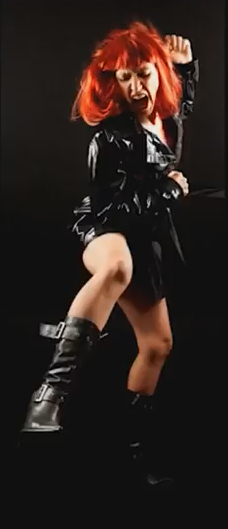

:toc: left
:toclevels: 3
:toc-title: Contents

= Portrait Lighting
V0.1, May-2017
:Author: Ian Cummings
:Email: 
:Date: May 2017
:Revision: V0.1

== Ed Verosky's 4 Basic Lighting Setups
=== Key - 45/45
One light setup; light is 45 horizontally offset, and 45 degrees down to subject.

With this we can do five of the basic lighting patterns.

See here link:portrait-lighting-five-basic-types.html[5 basic types] for more details.

=== Key & fill
Either another light, or a reflector

=== Cross lighting (key, hair)

and

and an example

or maybe

producing

=== Three point (key,fill,hair)

and also:

and an example

== One light setups

== Intray - needs finishing!!!

=== Rembrandt Lighting

This lighting set up is named after the famous Dutch painter who was famous for his low key and high contrast lighting style. This is also a great lighting set up for beginner photographers who don't have many lights yet in their studios. The reason is, you basically only need one light or two for this set up as it doesn't use any shadow fill or just a little. It is a simple one light set up that creates a chiaroscuro effect with only one side of the face well lit and a small triangle of light on the other side.

To set up a Rembrandt lighting set up, first place a key light at about 45 degrees from your subject and slightly above the subject's head. As the subject faces the camera, if you position the light at the right angle, you should see the small triangle of light on the opposite side of the subject's face. Make sure the triangle of light is not too big and doesn't pass the length and width of the eye and nose. If it does, adjust the light accordingly. Now that you have a nice contrasty image, it's ime to think about the fill. The point of this set up is to go easy on the fill, or even avoid it. However, that depends first of all on what type of key light you are using and also your style, how much you want to push the chiaroscuro effect. Many photographers use just a reflector or bounce to gently fill the shadows but some photographers also just like to use a smaller and softer lighting fixture. So, move your lights around and try different looks but remember, this set up is about achieving a dramatic look and keeping it simple.

=== Split Lighting

Split lighting is similar to Rembrandt type of lighting but even more dramatic. Another term used for this type of lighting is �side lighting�, used a lot in film noir cinematography. To achieve this look, just place your main light all the way to the side of your subject. The image will have one side well lit and the opposite in shadow. Then it�s up to you how much you want to add detail to the shadows. Just place a second light to the opposite side of lit area of the subject�s face and adjust the distance.

By placing the fill far away from the subject, you�ll be able to add just the right amount of the detail. If you place the light too close, then you�ll end up losing the side lighting effect. You may also add a background light and aim it to your background. This will help separate the subject from your background and will give you a three dimensional image.

=== Broad Light

With this set up you don�t really need to change the position of your lights much, compared to Rembrandt or split lighting. The reason it is called �broad light� style, is because the longer side of the subject�s face is lit. All you need to do is to have your subject face away from the light, which most of the times is positioned at 45 degrees from the subject. The subject�s chin, however, will turn to the opposite direction from the light, therefore the subject�s face from his/her nose to his/her ear will be well lit. So, is very easy to go from Rembrandt style to broad light style by just moving the position of the subject.

=== Butterfly Light

This type of lighting is also called �Paramount Lighting� because it was popular back in the 1930s in Hollywood. And the reason is called �Butterfly light� is because the light is positioned right in front the subject but at a steep angle facing down, therefore creating a shadow right underneath the subject�s nose that resembles a butterfly. The recommended angle is usually between 25 and 70 degrees.

It is considered a beauty lighting set up, mostly for women, and also it works best with people with pronounced cheekbones and a lean figure as slight shadows are created right below the cheekbones. Also remember you may position a bounce board below the subject as a fill. This will give a beautiful glow to the subject's face.

=== Loop Light

The loop light style is just a slight variation from the Paramount light. All you have to do is move the light to one side, usually to the right of the camera, but still have it at a high angle. This style, because of the shadows it creates, gives a sense of depth that other styles don't have. The reason is called looped lighting is because of the shadow that is created under and to the side of the nose that is loop-shaped.

=== Clamshell lighting
Lighting from above and below. The idea is to remove detail, filling in the shadows.
It can remove the appearance of wrinkles, acne, etc. Beauty pageant look.

 

get a good top light setting; butterfly lighting. Then add the bottom light but not *too* much! +
Here, picture 1 is just butterfly lighting; no lower light source. Images 2 & 3 show increasing amounts of lower light. The lower light shouldn't be any brighter that (3), that's as much as it can be. Image (4) is just wrong!

image::images/clamshell-results.png[] 

=== Summary
The more dramatic Rembrandt and split lighting, the more flattering broad light, and the beauty shots Paramount and loop lights.

While comments find this article useful, unfortunately, much of what has been written is simply incorrect.

When examining the first image, this is much closer to being a split light other than for the bit of misplaced splash of highlight on the cheek. A split light should have the eye in the shadow side of the face illuminated as opposed to the image used to demonstrate the split light in this article. By highlighting the shadow eye, depth in the subject is created and is even more important when creating a profile image of the subject using a split light.

A true Rembrandt light is created much as is stated but the will be in inverted triangle patch of light created by where the nose shadow touches the cheek shadow. Without a modeling light trying to create Rembrandt lighting using electronic flash is particularly difficult compared to creating the Modified Butterfly or Loop lighting which can easily be created by placing the light at an arms length and about 18 inches above the subjects head when viewing the subject full face. The latter is particularly critical when creating the 2/3 facial view.

Note that the views in a couple of the images have been turned too far and thus there is both a slight cutout on the far side of the head and some elongation of the nose (not overly noticeable due to the subject having been photographed from a low camera position.

Broad lighting is not a type of lighting effect but is simply the opposite of Short Lighting. The former lights the broad side of the face which is closer to the camera and is the highlighted side whereas the latter will create the highlight onto the side of the face away from the camera position. In the image created, one could simply leave the light and move the camera position to capture the light and short side of the face (the smaller of the two sides split by the nose). Then move the light to the opposite side and photograph the side of the face currently being shown. Both Modified Butterfly and Rembrandt light can be used with these to camera positions.

Lastly, the Butterfly light. As stated, if is generally used with the female form and has the name of Glamour Lighting as it tends to work best with an already beautiful woman. The key to creating this pattern of light is to be sure to place the light at a height directly in front of the subject that will create a shadow 2/3 the way down the upper lip WHEN THE SUBJECT IS SMILING!!! This is critical as if the light is placed so that the shadow extends 2/3 the way down the upper lip if the subject is not smiling, any image taken of the subject with a smile will generally cast a shadow onto the teeth of the subject which is not what is desired.

Hopefully this information will be of value.�
