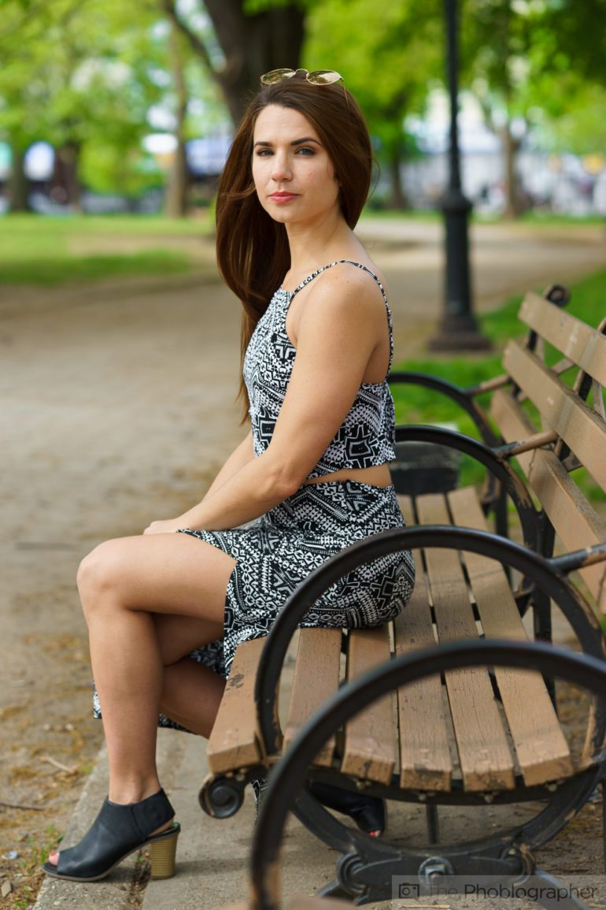
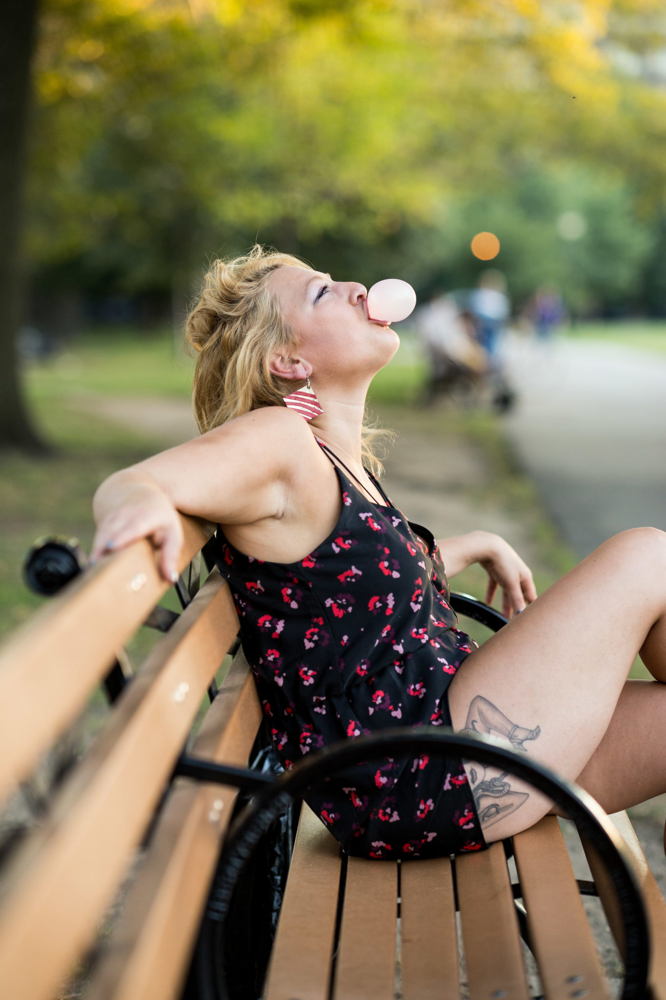
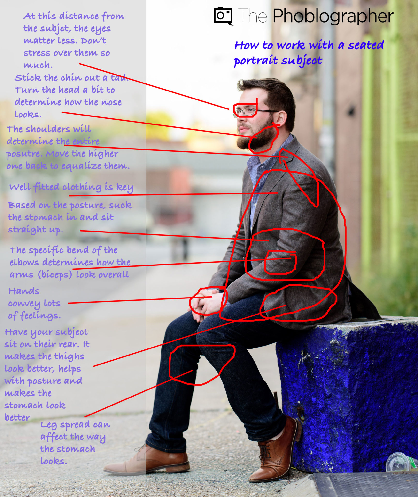
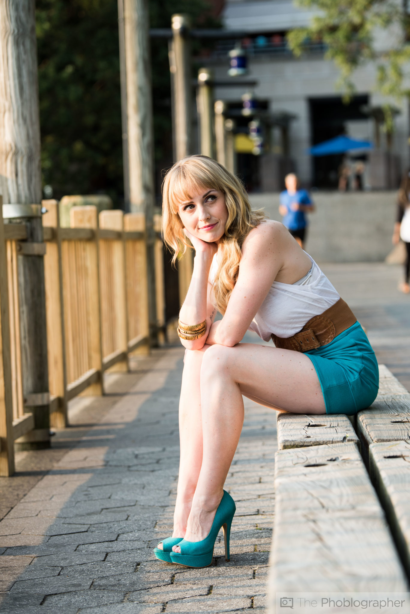

:toc: left
:toclevels: 3
:toc-title: Contents
= Posing
:Author: Ian Cummings
:Email:  
:Date: October 2017
:Revision: V0.1

== Have Your Subject Not Sit on the Thighs
For starters, when someone typically sits down, they try to have their buttocks and thighs cover as much of the seat as possible. It’s just more comfortable. But when you’re photographing someone, this can work against them. Because so much weight is being put onto the thighs, it can make them look unflattering. You can negate this by having them sit only on their buttocks. That way the thighs aren’t squished.

When they’re sitting forward near the front of the seat to unsquish their thighs, then you need to find a way to work with their posture. This comes with a variety of options. Depending on their body type and the clothing that they’re wearing, you can have them lean forward and more into the camera. Otherwise, sometimes a great idea is to have them stretch out a bit and become more comfortable. Lean back, etc.

== Make the arms do something
A BIIIIIGGGG part of portraiture is what the arms and hands are doing. You can do the typical arm crossing but that gets boring after a while. Perhaps have them work with a prop or something else that tells us about them. This specifically gets tied in again to body language because everyone uses their hands to be expressive.

== Are They Sitting Naturally?
Note how people actually sit based on what setting they’re in and the situation like watching television vs being in a bar stool. Make it look natural and you can do this by giving the person a mental situation to be in. Actors and actresses are usually the ones to ask for this.

== Light from Above and the Side
Lastly, if you’re not necessarily using natural light to photograph your subject, then use a large light modifier and light them from above and slightly to the side. This will give the most flattering light possible in the scene.

(From https://www.thephoblographer.com/2017/03/03/the-essentials-of-photographing-seated-portrait-subjects/?utm_content=bufferd8c41&utm_medium=social&utm_source=twitter.com&utm_campaign=buffer)